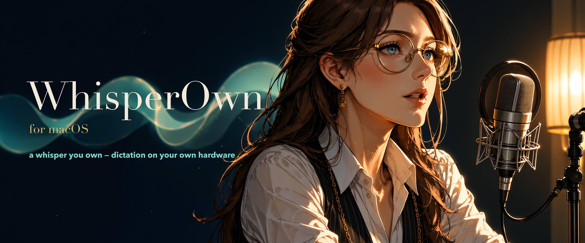
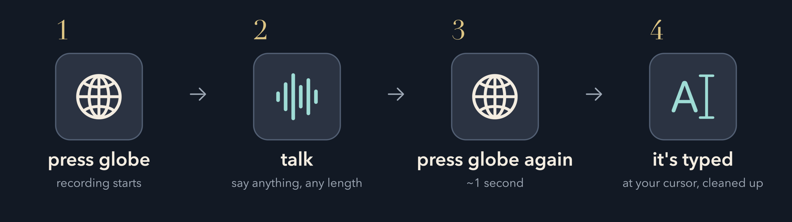

<p align="center"></p>

# WhisperOwn

<p align="center">
  
  
  
  
  
</p>

**A whisper you own.** Press Globe, talk, press it again, and the cleaned
transcript is pasted at your cursor. No cloud, accounts, subscriptions, or
telemetry. Audio, transcription, cleanup, history, and paste all run in one
native macOS process.

<p align="center"></p>

## What it is

- **Fast local transcription.** Parakeet Unified runs through Core ML on Apple
  silicon and stays loaded while WhisperOwn is open.
- **Deterministic cleanup.** Regex rules remove fillers and restart artifacts;
  there is no LLM rewrite. The rules are visible from the menubar and documented
  in [POSTPROCESS.md](POSTPROCESS.md).
- **Recoverable.** Every dictation is also saved as a WAV. Failed
  transcriptions can be replayed or retried.
- **Inspectable.** History is SQLite, personal vocabulary is JSON, and local
  stop-to-paste p50/p95 timings are available from **Performance…**.

## Requirements

- Apple silicon Mac (M1 or newer)
- macOS 14 Sonoma or later
- Xcode Command Line Tools: `xcode-select --install`
- About 594 MB for the speech model

No Python, Homebrew, background service, localhost port, or globally installed
package is required.

## Install from source

```sh
git clone https://github.com/dannyboy-ai/whisperown.git
cd whisperown
./install.sh
```

The installer builds one Swift app, signs it with a local identity when one is
available (otherwise ad hoc), copies it to `/Applications`, and opens it. Re-run
the same command after pulling an update.

WhisperOwn then guides you through:

1. **Speech model.** A one-time 594 MB download with progress, retry, and
   cancellation. The model is stored under WhisperOwn's Application Support
   directory and validated before use.
2. **Microphone.** Used only to record the local WAV.
3. **Accessibility.** Used to observe Globe globally and paste into the focused
   app.
4. **Globe key.** Set **System Settings → Keyboard → “Press 🌐 key to” → “Do
   Nothing”** so macOS does not open its emoji/input-source action too.

Without a stable signing identity, rebuilding changes the app's fingerprint and
macOS may require Accessibility to be toggled again. `build.sh` automatically
uses an Apple Development identity when present; set `WHISPEROWN_SIGN_ID` to
choose one explicitly.

## Use

Press **Globe/Fn** to start recording; the menubar microphone turns red. Press it
again to transcribe and paste. Use **Ctrl+Cmd+V** to paste the last transcript
again.

| Menu item | What it does |
|---|---|
| **Show History** | Browse transcript text and replay saved audio. |
| **Re-transcribe last** | Retry the most recent WAV after a failure. |
| **Reveal recording in Finder** | Open the latest recording on disk. |
| **Dictionary…** | Add whole-word `heard → meant` replacements. |
| **Cleanup Rules…** | Inspect the active deterministic cleanup rules. |
| **Speech Model…** | View model readiness or retry a failed download. |
| **Performance…** | View local stop-to-paste median, p95, and the latest phase breakdown. |
| **Open at Login** | Register/unregister the app with macOS `SMAppService`. |
| **Permissions Guide…** | Reopen the macOS setup walkthrough. |

An inference or history failure flashes the icon amber and leaves the WAV on
disk. There is no cloud fallback.

## Architecture

```text
microphone
  → 16 kHz samples ─────────────→ FluidAudio / Parakeet Unified
  → recoverable WAV                    ↓
                                deterministic Swift cleanup
                                         ↓
                               SQLite history + cursor paste
```

The live path sends the retained in-memory samples directly to FluidAudio; it
does not reopen the WAV. The model manager is loaded once and reused.

Application data:

```text
~/Library/Application Support/WhisperOwn/
├── Models/
├── recordings/
├── dictionary.json
├── whisperown.db
├── timings.jsonl
└── whisperown.log
```

The only routine network access is the first-run model download.

## Development

```sh
swift build
swift test
```

`Sources/Postprocessor.swift` is the cleanup implementation.
`Tests/Fixtures/postprocess.json` is the behavior contract; every fixture is also
checked for idempotency. Add both the desired case and a near-miss before
changing a rule.

The optional real-model smoke check uses a local WAV and does not commit audio:

```sh
WHISPEROWN_SMOKE_WAV=/path/to/recording.wav \
  swift test --filter testRealAudioPipelineWhenFixtureIsProvided
```

## Troubleshooting

- **Globe opens emoji or switches input source:** set “Press 🌐 key to” to “Do
  Nothing.”
- **Globe does nothing:** reopen **Permissions Guide…** and check
  Accessibility.
- **Recording works but nothing pastes:** re-toggle Accessibility for the
  installed `/Applications/WhisperOwn.app`.
- **The icon flashes amber:** use **Re-transcribe last**. Details are in
  `~/Library/Application Support/WhisperOwn/whisperown.log`.
- **The model download failed:** open **Speech Model…** and retry. Partial
  downloads are resumable.

## Privacy

No accounts and no telemetry. Audio, transcripts, history, dictionary entries,
models, logs, and timing records stay under
`~/Library/Application Support/WhisperOwn/`. Deleting that directory erases
them.

## Uninstall

First turn off **Open at Login** from the WhisperOwn menu, then:

```sh
rm -rf /Applications/WhisperOwn.app
rm -rf ~/Library/Application\ Support/WhisperOwn/
```

Remove WhisperOwn from **System Settings → Privacy & Security → Accessibility**
and **Microphone** if you also want to clear macOS's permission entries.

## Third-party components

- [FluidAudio](https://github.com/FluidInference/FluidAudio) provides the
  Core ML speech runtime under Apache-2.0.
- The downloaded
  [Parakeet Unified model](https://huggingface.co/nvidia/parakeet-unified-en-0.6b)
  is maintained and licensed upstream by NVIDIA.

## Expectations

Software I run every day, shared as-is. PRs welcome; issues may sit; no roadmap.
Fork freely.

## License

MIT
